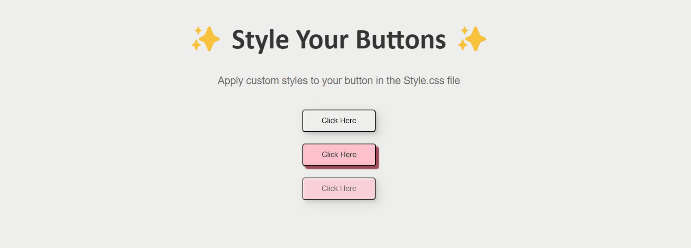
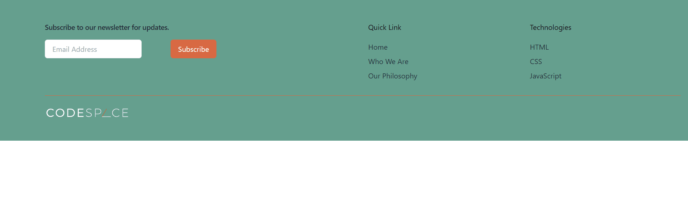

<!--My Introduction -->
# Hi there, I am Amber Jones 🧕🏻
I'm an aspiring Software Developer who lives in Cape Town, South Africa. I am currently a student at CodeSpace Academy and am enrolled in the Software Development Program. I am passionate about learning new coding languages and tools to make my projects next-level. I enjoy putting my coding skills to the test and solve problems. 

My career goals are to become full stack and study further in the subject of software architecture. And later on after more experience I hope to volunteer my time teaching young aspiring developers. My current confidence lies in frontend development.
<!--Skills and Interests-->
## Skills and Interests:

### Skills:

* ✅ Fast learner
* 💪 Motivated
* 🧠 Problem-solver
* 👩🏻‍💻 Tenacious

### Interests:

* Software development
* Coding languages
* Arabic

<!--Technologies and Frameworks -->
## My Technologies and Frameworks:

	<code></code>
	<code></code>
	<code></code>
	<code></code>
	<code></code>
	<code></code>
	<code></code>
	<code></code>

<!--Languages -->
## Languages:

 	<code></code>
	<code></code>
	<code></code>
	

<!--Projects showcase -->
## My Projects:
 
 

<!--Social Links -->
## Socials:

	<code></code>
 	<code></code>
  	<code></code>

 

<!--Contact info -->

